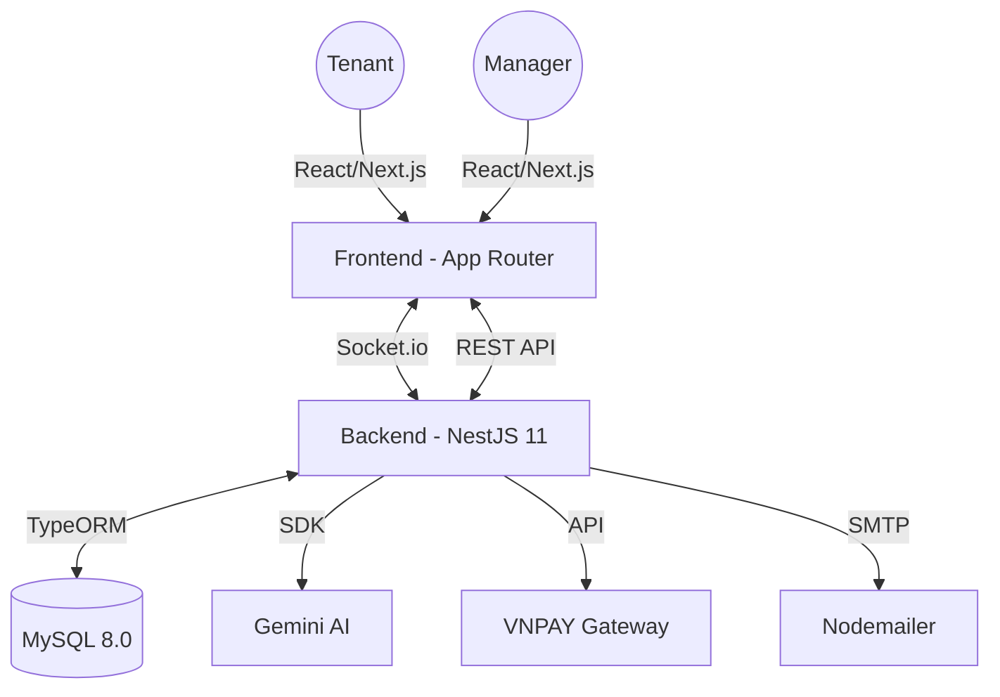

# 🏠 SmartTrọ - AI-Powered Boarding House Management

[](https://nextjs.org/)
[](https://nestjs.com/)
[](https://www.mysql.com/)
[](https://socket.io/)
[](https://deepmind.google/technologies/gemini/)
[](https://vnpay.vn/)

A professional, full-stack **Smart Boarding House Management System** built with **NestJS 11** and **Next.js 15**. This project provides a robust RESTful API and a real-time dashboard for managing rooms, tenants, automated invoices, and AI-powered resident assistance.

---

## 🖼️ Screenshots

<div align="center">
  <p align="center"><b>Dashboard Quản trị & Theo dõi Doanh thu</b></p>
  
  <br/><br/>
  <p align="center"><b>Hệ thống Chat Real-time & Chăm sóc khách hàng</b></p>
  
  <br/><br/>
  <p align="center"><b>Thanh toán trực tuyến VNPAY Sandbox</b></p>
  
</div>

---

## ✨ Features

- **📊 Management Dashboard:** Real-time statistics, revenue tracking, and room occupancy status with **Recharts**.
- **💬 Real-time Communication:** Direct Admin-to-Tenant messaging and instant notifications via **Socket.io**.
- **💳 Automated Payments:** Online rent payment integration with **VNPAY Sandbox** (SIT context support).
- **🤖 AI Resident Copilot:** Intelligent assistance for tenants' queries using **Google Gemini AI**.
- **🛠️ Asset & Maintenance:** Comprehensive asset tracking with **Bulk creation** and image-based maintenance reporting.
- **📄 Contract & Invoices:** Digital contract records and automated monthly invoice generation with email alerts.

---

## 🏗️ Architecture



---

## 🚀 Getting Started

### 1. Prerequisites
- Node.js (v20+) & MySQL 8.0
- Google Gemini API Key & VNPAY Merchant Credentials

### 2. Installation
```bash
# Clone the repository
git clone https://github.com/your-username/qlnt.git

# Setup Backend
cd backend && npm install
npm run start:dev

# Setup Frontend
cd ../frontend && npm install
npm run dev
```

---

## 👤 Author
Developed with ❤️ by **LE NGUYEN THANH DAT**

---
*SmartTrọ - Simplifying your boarding house management.*